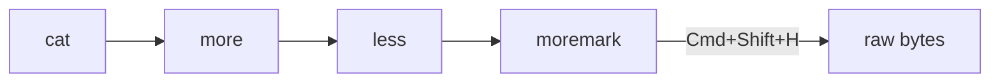

# the tour

**bold**, *italic*, `code`, [a link](https://github.com/jasonmimick/moremark), and a task list:

- [x] native window
- [x] live reload
- [ ] your feature here

| member | year | renders where |
|---|---|---|
| cat | 1971 | terminal |
| more | 1978 | terminal |
| less | 1983 | terminal |
| moremark | 2026 | a real window |



```python
def preview(path):
    return "rendered, not dumped"
```
